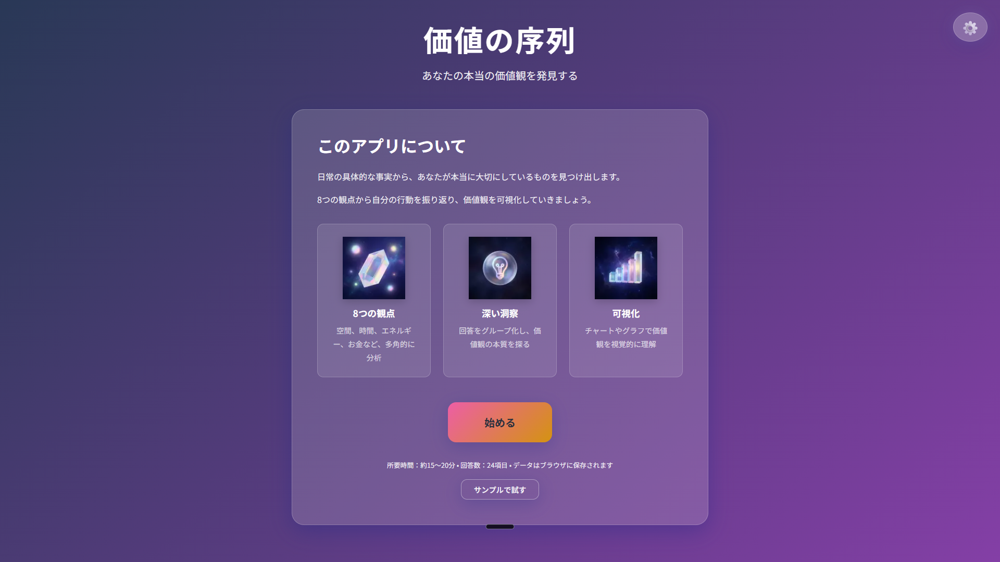
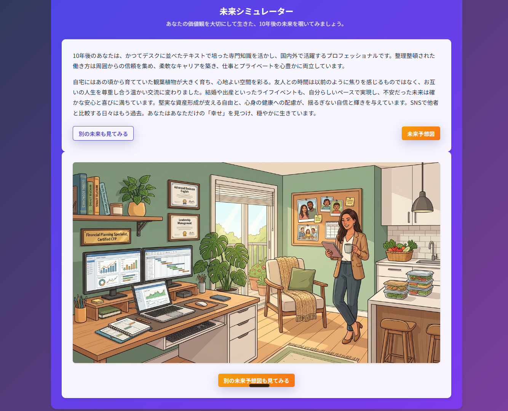
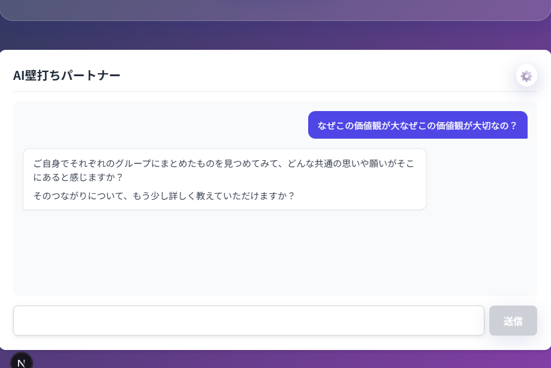
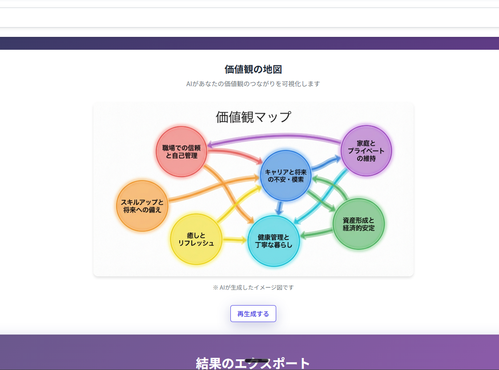

<a name="readme-top"></a>

<!-- PROJECT SHIELDS -->
[![MIT License][license-shield]][license-url]
[![Next.js][nextjs-shield]][nextjs-url]
[![React][react-shield]][react-url]

<!-- PROJECT LOGO -->
<br />
<div align="center">
  <h1 align="center">価値の序列</h1>
  <h3 align="center">Value Hierarchy</h3>

  <p align="center">
    あなたの本当の価値観を発見する自己分析Webアプリケーション
    <br />
    日常の具体的な事実から、自分が本当に大切にしているものを見つけ出す
    <br />
    <br />
    <a href="#getting-started"><strong>始める →</strong></a>
    <br />
    <br />
    <a href="#features">機能紹介</a>
    ·
    <a href="https://github.com/takamiya1021/app041-1-value-hierarchy/issues">バグ報告</a>
    ·
    <a href="https://github.com/takamiya1021/app041-1-value-hierarchy/issues">機能リクエスト</a>
  </p>
</div>

<!-- ABOUT THE PROJECT -->
## 📖 About The Project

**価値の序列アプリ**は、8つの観点から自己分析を行い、あなたの本当の価値観を発見するWebアプリケーションです。

### なぜこのアプリが必要か

多くの人が「自分の価値観」を漠然と理解していても、具体的に言語化するのは難しいものです。このアプリは、日常の具体的な事実（空間、時間、お金の使い方など）から、あなたが**本当に**大切にしているものを明確にします。

### 解決する課題

- 💭 自分の価値観が曖昧で分からない
- 🎯 人生の優先順位を整理したい
- 🤔 自己理解を深めたい
- 📝 キャリアや人生の方向性を考えたい

<p align="right">(<a href="#readme-top">back to top</a>)</p>

## 📸 Screenshots

<div align="center">
  
  <p><em>ウェルカム画面 - 8つの観点から価値観を発見</em></p>
</div>

<div align="center">
  
  <p><em>未来シミュレーター - 10年後の自分との対話</em></p>
</div>

<div align="center">
  
  <p><em>AI壁打ちパートナー - ソクラティック対話で深掘り</em></p>
</div>

<div align="center">
  
  <p><em>価値観の地図 - AIが関連性を可視化</em></p>
</div>

<p align="right">(<a href="#readme-top">back to top</a>)</p>

## ✨ Features

### コア機能

- 📋 **8つの観点から自己分析**
  - 空間の使い方、時間の使い方、エネルギーの注ぎ方、お金の使い方
  - 思考の傾向、コミュニケーション、学習の方向性、自己管理

- 🎨 **インタラクティブなグルーピング**
  - 24項目の回答を自由にグループ化
  - 色分けによる視覚的な整理
  - ドラッグ&ドロップで直感的に操作

- 📊 **データ可視化**
  - バーチャート、円グラフで価値観を可視化
  - 各グループの割合を一目で把握

- 💾 **自動保存 & エクスポート**
  - ブラウザローカルに自動保存（プライバシー保護）
  - JSON・テキスト形式でエクスポート可能

### 🤖 AI機能（Gemini統合）

- 🎭 **ソクラティック対話**
  - AIが質問を通じて価値観を深掘り
  - 「なぜ？」を繰り返して本質に到達

- 🔮 **未来の自分との対話**
  - 10年後の視点から現在の価値観を分析
  - 長期的な人生設計のヒント

- 🗺️ **価値観マップ**
  - AIが価値観の関連性を可視化
  - 隠れた共通点や優先順位を発見

### 📱 PWA対応

- ⚡ **オフライン動作**
  - 初回ロード後はネット不要
  - いつでもどこでも自己分析

- 📲 **インストール可能**
  - ホーム画面に追加してアプリのように使用
  - iOS・Android対応

<p align="right">(<a href="#readme-top">back to top</a>)</p>

## 🚀 Tech Stack

**Frontend:**
- [Next.js 16](https://nextjs.org/) - App Router
- [React 19](https://react.dev/) - UI ライブラリ
- [TypeScript](https://www.typescriptlang.org/) - 型安全性
- [Tailwind CSS v4](https://tailwindcss.com/) - スタイリング
- [Recharts](https://recharts.org/) - データ可視化

**AI Integration:**
- [Gemini API](https://ai.google.dev/) - AI対話機能
- gemini-2.5-flash - テキスト生成モデル

**PWA:**
- [next-pwa](https://github.com/shadowwalker/next-pwa) - Progressive Web App

**Storage:**
- localStorage - 完全ローカル保存（サーバー不要）

<p align="right">(<a href="#readme-top">back to top</a>)</p>

<!-- GETTING STARTED -->
## 🎯 Getting Started

### Prerequisites

- Node.js 18.0以上
- npm または yarn

### Installation

1. **リポジトリをクローン**

```bash
git clone https://github.com/takamiya1021/app041-1-value-hierarchy.git
cd app041-value-hierarchy
```

2. **依存関係をインストール**

```bash
npm install
```

3. **開発サーバーを起動**

```bash
npm run dev
```

4. **ブラウザで開く**

http://localhost:3000 にアクセス

### AI機能を使う場合（オプション）

1. **Gemini APIキーを取得**
   - [Google AI Studio](https://makersuite.google.com/app/apikey) でAPIキーを発行

2. **アプリ内でAPIキーを設定**
   - アプリの設定画面からAPIキーを入力
   - ローカルストレージに安全に保存されます

<p align="right">(<a href="#readme-top">back to top</a>)</p>

<!-- USAGE -->
## 📖 Usage

### 基本的な使い方

1. **ウェルカム画面**
   - 「始める」ボタンをクリック

2. **質問に回答**
   - 8つのカテゴリーについて、それぞれ3つの具体例を入力
   - プログレスバーで進捗を確認

3. **回答をグループ化**
   - 似た回答をドラッグ&ドロップでグループ化
   - グループ名を付けて整理

4. **分析画面で可視化**
   - グラフで価値観の割合を確認
   - 各グループの「なぜ？」を深掘り

5. **AI対話（オプション）**
   - ソクラティック対話で本質を探る
   - 未来の自分と対話して長期視点を得る
   - 価値観マップで関連性を発見

6. **結果をエクスポート**
   - JSON・テキスト形式でダウンロード
   - 自己分析の記録として保存

<p align="right">(<a href="#readme-top">back to top</a>)</p>

## 🏗️ Project Structure

```
app041-value-hierarchy/
├── app/
│   ├── page.tsx              # ウェルカム画面
│   ├── question/[id]/
│   │   └── page.tsx          # 質問画面（動的ルート）
│   ├── summary/
│   │   └── page.tsx          # まとめ・グルーピング画面
│   ├── analysis/
│   │   └── page.tsx          # 分析・可視化画面
│   ├── api/generate/
│   │   └── route.ts          # Gemini API エンドポイント
│   ├── layout.tsx            # ルートレイアウト
│   ├── manifest.ts           # PWAマニフェスト
│   └── globals.css           # グローバルスタイル
├── components/
│   ├── ApiKeyModal.tsx       # APIキー入力UI
│   ├── SocraticChat.tsx      # ソクラティック対話
│   ├── FutureSelf.tsx        # 未来の自分との対話
│   └── ValueMap.tsx          # 価値観マップ
├── lib/
│   ├── types.ts              # 型定義
│   ├── storage.ts            # ローカルストレージ管理
│   ├── ai.ts                 # AI機能ユーティリティ
│   └── sampleData.ts         # サンプルデータ
├── public/
│   └── icons/                # PWAアイコン
├── doc/                      # ドキュメント
│   ├── requirements.md       # 要件定義書
│   ├── design.md             # 技術設計書
│   └── implementation_plan.md # 実装計画書
└── package.json
```

<p align="right">(<a href="#readme-top">back to top</a>)</p>

## 🔒 Privacy & Security

- ✅ **完全ローカル保存** - すべてのデータはブラウザのlocalStorageに保存
- ✅ **サーバー送信なし** - 個人情報はサーバーに一切送信されません
- ✅ **APIキーの安全管理** - Gemini APIキーもローカル保存のみ
- ✅ **オープンソース** - コードは完全に公開、透明性を確保

<p align="right">(<a href="#readme-top">back to top</a>)</p>

## 🎨 Design Concept

**「静かな内省の空間」**

- 🌙 **落ち着いた配色** - 深い青灰色、紫、金色
- 🪶 **ミニマルデザイン** - 余白を活かした洗練されたUI
- ✨ **滑らかなアニメーション** - 心地よい体験
- 📱 **レスポンシブ** - あらゆるデバイスで快適に

<p align="right">(<a href="#readme-top">back to top</a>)</p>

## 🚀 Build & Deploy

### Production Build

```bash
npm run build
npm run start
```

### Deploy to Vercel (推奨)

[](https://vercel.com/new/clone?repository-url=https://github.com/takamiya1021/app041-1-value-hierarchy)

### Environment Variables

Gemini AI機能を使用する場合、以下の環境変数をVercelで設定してください：

```env
# オプション: Gemini APIキー（アプリ内で設定可能）
NEXT_PUBLIC_GEMINI_API_KEY=your-api-key-here
```

<p align="right">(<a href="#readme-top">back to top</a>)</p>

## 🤝 Contributing

コントリビューションは大歓迎です！以下の手順でお願いします：

1. このリポジトリをフォーク
2. フィーチャーブランチを作成 (`git checkout -b feature/amazing-feature`)
3. 変更をコミット (`git commit -m 'Add amazing feature'`)
4. ブランチにプッシュ (`git push origin feature/amazing-feature`)
5. プルリクエストを開く

<p align="right">(<a href="#readme-top">back to top</a>)</p>

## 📝 License

このプロジェクトはMITライセンスの下で公開されています。詳細は [LICENSE](LICENSE) ファイルをご覧ください。

<p align="right">(<a href="#readme-top">back to top</a>)</p>

## 🙏 Acknowledgments

- インスピレーション: 自己分析ワークブックの一般的な手法
- [Next.js](https://nextjs.org/) - 素晴らしいReactフレームワーク
- [Recharts](https://recharts.org/) - 美しいグラフライブラリ
- [Google Gemini](https://ai.google.dev/) - 強力なAI API
- [Tailwind CSS](https://tailwindcss.com/) - 効率的なスタイリング

<p align="right">(<a href="#readme-top">back to top</a>)</p>

## 📧 Contact

**吉倉大晄 (Yoshikura Hiroaki)**

- GitHub: [@takamiya1021](https://github.com/takamiya1021)
- Project Link: [https://github.com/takamiya1021/app041-1-value-hierarchy](https://github.com/takamiya1021/app041-1-value-hierarchy)

<p align="right">(<a href="#readme-top">back to top</a>)</p>

## 🗺️ Roadmap

- [x] コア機能実装（8カテゴリー質問、グルーピング、可視化）
- [x] Gemini AI統合（3種類の対話機能）
- [x] PWA対応（オフライン動作、インストール可能）
- [x] APIキー管理UI
- [x] データエクスポート（JSON、テキスト）
- [ ] 多言語対応（英語、中国語）
- [ ] データインポート機能
- [ ] 価値観の経時変化追跡
- [ ] コミュニティ機能（匿名で価値観を共有）

より詳細なロードマップは [Issues](https://github.com/takamiya1021/app041-1-value-hierarchy/issues) をご覧ください。

<p align="right">(<a href="#readme-top">back to top</a>)</p>

---

<div align="center">

**開発: 2025年**

Made with ❤️ by Yoshikura Hiroaki

</div>

<!-- MARKDOWN LINKS & IMAGES -->
[license-shield]: https://img.shields.io/github/license/takamiya1021/app041-1-value-hierarchy.svg?style=for-the-badge
[license-url]: https://github.com/takamiya1021/app041-1-value-hierarchy/blob/main/LICENSE
[nextjs-shield]: https://img.shields.io/badge/Next.js-16-black?style=for-the-badge&logo=next.js
[nextjs-url]: https://nextjs.org/
[react-shield]: https://img.shields.io/badge/React-19-61DAFB?style=for-the-badge&logo=react
[react-url]: https://react.dev/
