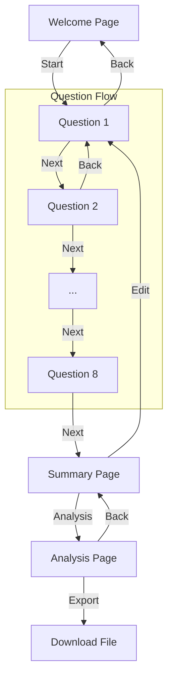

# 基本設計書

## 1. アーキテクチャ
**フレームワーク**: Next.js 15 (App Router)
**言語**: TypeScript
**スタイリング**: Vanilla CSS (CSS Modules)
**状態管理**: React useState + Context (必要に応じて) + localStorage
**可視化ライブラリ**: Recharts

### ディレクトリ構成
```
app041-value-hierarchy/
├── app/
│   ├── globals.css          # グローバルスタイル（変数定義など）
│   ├── layout.tsx           # ルートレイアウト
│   ├── page.tsx             # Welcomeページ
│   ├── Welcome.module.css
│   ├── question/
│   │   └── [id]/
│   │       ├── page.tsx     # 質問ページ（動的ルート）
│   │       └── Question.module.css
│   ├── summary/
│   │   ├── page.tsx         # まとめ・グルーピングページ
│   │   └── Summary.module.css
│   └── analysis/
│       ├── page.tsx         # 分析・可視化ページ
│       └── Analysis.module.css
├── lib/
│   ├── types.ts             # 型定義
│   └── storage.ts           # localStorage操作ユーティリティ
├── public/                  # 静的アセット
└── doc/                     # ドキュメント
```

## 2. 画面遷移図 (Mermaid)



## 3. データモデル設計

### UserData
アプリ全体で管理するデータ構造。

```typescript
interface UserData {
  answers: Answer[];    // 回答リスト
  groups: Group[];      // 作成されたグループ
  insights: Insight[];  // 分析コメント
  timestamp: number;    // 最終更新日時
}
```

### Answer
個々の回答データ。

```typescript
interface Answer {
  id: number;           // ユニークID (1-24)
  category: number;     // カテゴリーID (1-8)
  index: number;        // カテゴリー内の順序 (1-3)
  text: string;         // 回答テキスト
  purpose?: string;     // 目的（2番目の回答のみ）
  groupId?: string;     // 所属するグループID（UUID）
}
```

### Group
グルーピングされた価値観の塊。

```typescript
interface Group {
  id: string;           // UUID
  name: string;         // グループ名
  color: string;        // 表示色
  answerIds: number[];  // 含まれる回答IDのリスト
}
```

### Insight
グループに対する考察。

```typescript
interface Insight {
  groupId: string;      // 対象グループID
  text: string;         // 考察テキスト
}
```

## 4. コンポーネント設計

### 共通コンポーネント
- 今回は小規模アプリのため、ボタンやカードなどのUIパーツは各ページコンポーネント内またはCSSクラスとして実装し、過度なコンポーネント分割は行わない方針とする。
- ただし、`QuestionPage` におけるフォーム部分は、状態管理の複雑さを避けるため、`key` プロパティによる強制リマウントを利用して制御する。

### 状態管理戦略
- **永続化**: `lib/storage.ts` を介して `localStorage` と同期する。
- **読み込み**: 各ページコンポーネントの `useEffect` でロードし、ローカルステート (`useState`) に反映する。
- **保存**: ユーザー操作（次へボタン、保存ボタン）のタイミングで `localStorage` に書き込む。
